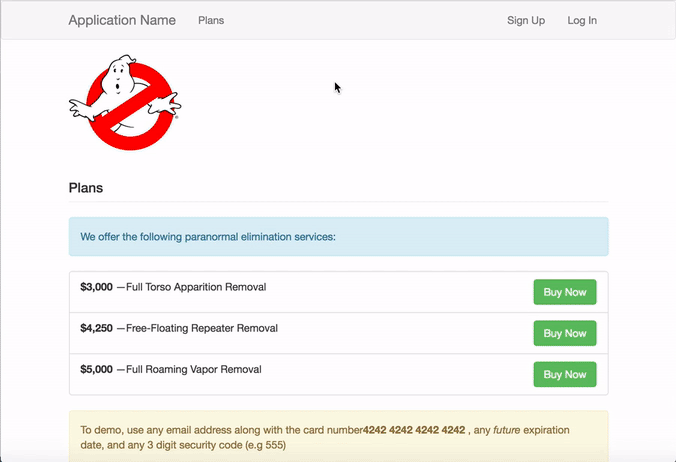

# The Meteor Chef - Stripe Checkout
A starting point for Meteor apps with Stripe Checkout (React code).
A tutorial is coming.

<table>
  <tbody>
    <tr>
      <th>Base Version</th>
      <td>v4.6.0</td>
    </tr>
    <tr>
      <th>Meteor Version</th>
      <td>v1.4</td>
    </tr>
  </tbody>
</table>

[Read the Documentation](http://themeteorchef.com/base)

## Preview



## Get Started

- Create a stripe account and get pk_test_TOKEN and sk_test_TOKEN

- Add a settings-development.json file to root folder

```
{
  "public": {
    "plans": [
      {
        "_id": 1,
        "name": "Full Torso Apparition Removal",
        "amount": {
          "cents": 300000,
          "usd": "$3,000"
        }
      },
      {
        "_id": 2,
        "name": "Free-Floating Repeater Removal",
        "amount": {
          "cents": 425000,
          "usd": "$4,250"
        }
      },
      {
        "_id": 3,
        "name": "Full Roaming Vapor Removal",
        "amount": {
          "cents": 500000,
          "usd": "$5,000"
        }
      }
    ],
    "stripe": "<YOUR pk_test_TOKEN>"
  },
  "private": {
    "stripe": "<YOUR sk_test_TOKEN>"
  }
}
```

- launch the application
`meteor npm install` then `meteor --settings settings-development.json`
